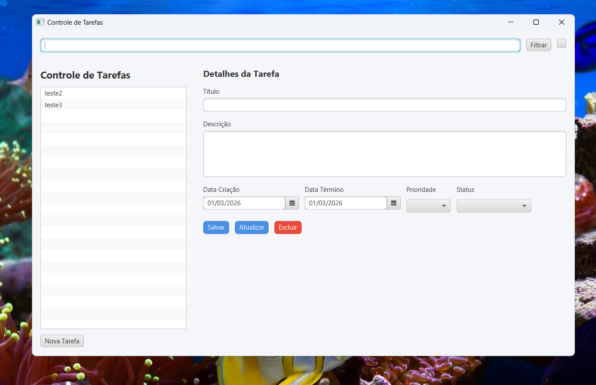
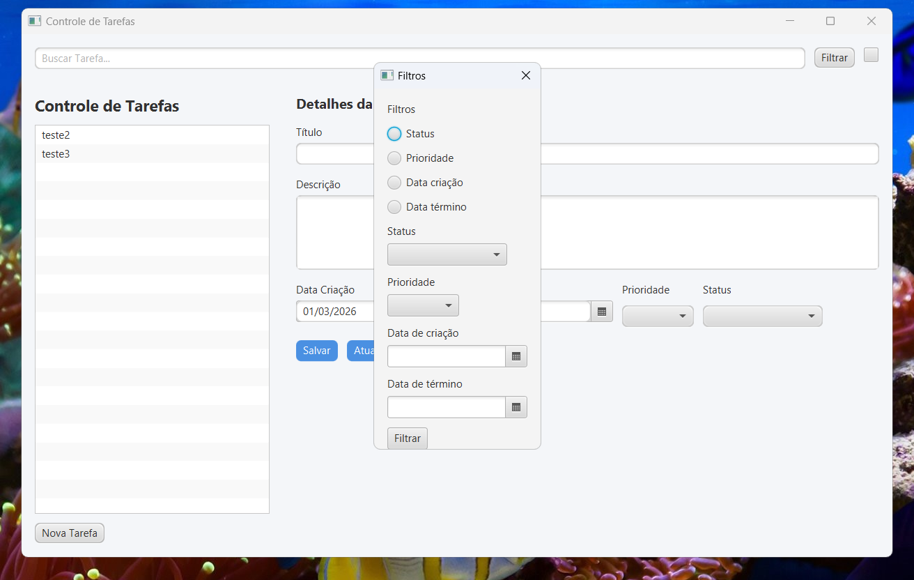
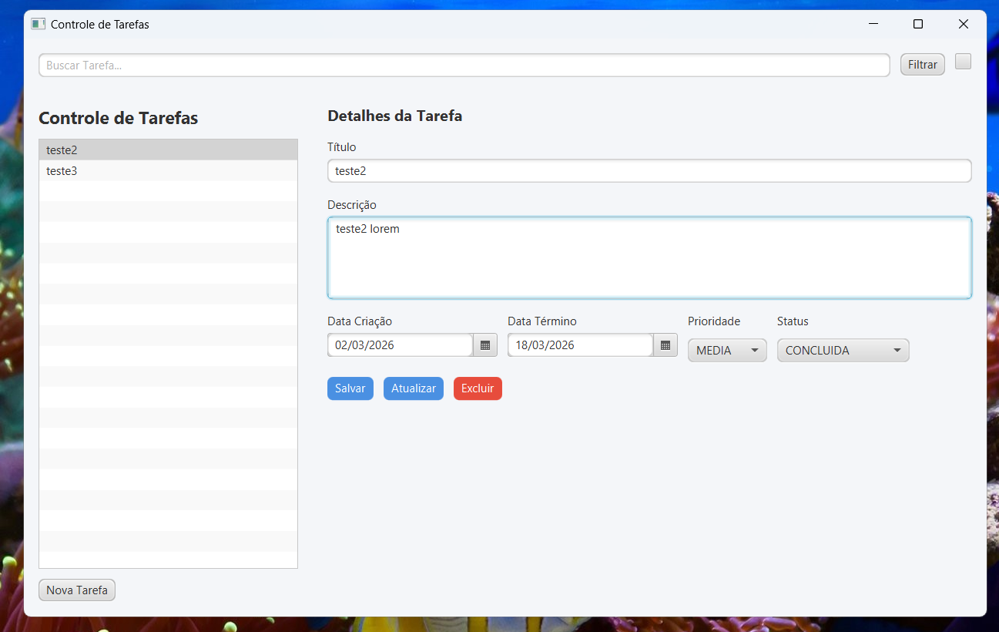

# Gerenciador de Tarefas com Java

Projeto desktop desenvolvido em **Java + JavaFX** com foco em organização de código, separação de responsabilidades e persistência simples usando arquivo CSV.

---

## Tecnologias

- Java  
- JavaFX  
- FXML
- Arquivo CSV para persistência  
- Arquitetura MVC  
- Padrão Repository  

---

## Estrutura do Projeto

```
src/
 ├─ application
 ├─ model
 ├─ repository
 ├─ service
 ├─ test
 └─ view
screenshots/
data/
```
- **application** → execução da aplicação
- **model** → entidades e regras de negócio  
- **repository** → contrato + implementação de persistência  
- **service** → intermedia interface e lógica  
- **test** → testes da aplicação
- **view** → interface gráfica (JavaFX)
- **screenshots** → capturas de tela
- **data** → armazenamento do arquivo CSV  

---

## Funcionalidades

- Criar tarefas  
- Listar tarefas  
- Persistência automática em CSV  
- Carregamento das tarefas ao iniciar o sistema  

---

## Capturas de tela







---

## Como executar

1. Clone o repositório:

```bash
git clone https://github.com/Blitk/Gerenciador_de_Tarefas_com_Java.git
```

2. Abra na sua IDE (IntelliJ, Eclipse ou VS Code).

3. Configure o JavaFX corretamente.

4. Execute a classe principal do projeto.

---

## Decisões de Projeto

- Uso de **CSV** em vez de banco de dados para manter simplicidade.
- Uso de **interface Repository** para permitir futura troca da camada de persistência.
- Separação em camadas para evitar acoplamento entre interface e regra de negócio.

---

## Próximos passos

  
- Aplicar a lógica do filtro 
- Ordenação por data  
- (futuramente) implementar opção para Persistência com banco de dados (SQLite ou H2)  
- Testes unitários  

---

## Autor

Raphael Rodrigues Oliveira
https://github.com/Blitk
https://br.linkedin.com/in/raphael-rodrigues-oliveira-b5675a174
